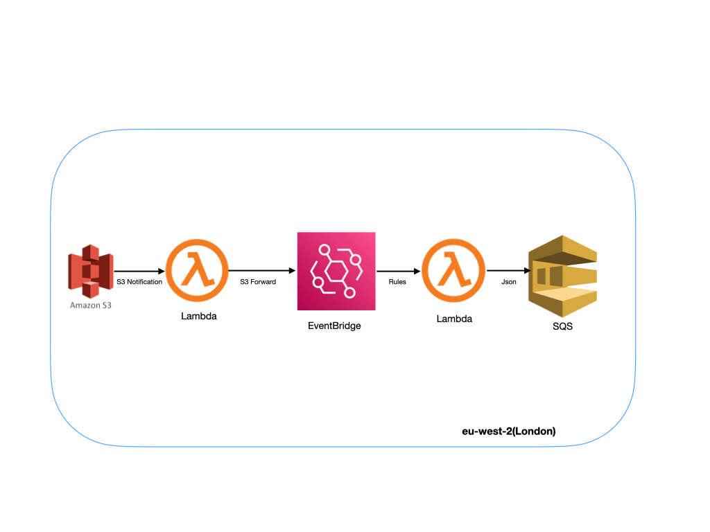

# Data Pipeline

### Problem Statement:

The goal is to design a data processing pipeline taking input in CSV format from a partner and to produce output in JSON format for internal processing.

### Assumptions:
   To solve the problem satatement , could undertand we would  need ETL with EDA, which is Event driven Architecture with ETL Processing.

#### Condisderations on solutions:
    1. Simple Architecure with Events
    2. Scalability 
    3. Reliability
    4. Cost Effective

#### Solution:

 Based on the problem statement and considertaions, I have considered AWS  serverless ETL services such as AWS Glue, AWS step funtions , AWS DataPipline and Lambda with supporting services.

#### Data Pipeline Architecture: 

   

#### Why did I choose Eventbridge and Lambda ?  

 My Intial though was using AWS Glue , because it provides centralized datacatalogs and supports long running jobs. But based on the requirement , we would need small running jobs and evenbased . Even for Glue we would need Lamba/Eventbrige to trigger event based processing. Lambda can scale upto 1000 concurnet process with default limit. Architeture can evolve based on the proceesing need.  

#### Why S3 Notifications and EventBridge?  

 S3 Notification helps us to achive Near Realtime ETL solution than schedueled approach.  Included eventbrige to have better control over prefix and suffix rules which s3 notifications missed to provide as its based on XML.  

#### Why SQS ? 

 As the name suggest its simple, serverless and provides higher scalabillity and throughput.  

#### Security:  

1. Encryption at rest and transit with the help of SSE-S3 or KMS for both S3 and SQS
2. IAM Roles and Policies across the services used

#### Possible Improvements:

1. If the downtream application is sensitive to latency and need multiple targets, would chose msk (but its not serverless)
2. When the business logic grow , using single Lambda funtion for ETL will add code complexity. could use modular approach with setpfuntions.
3. IAC using Terrafrom 